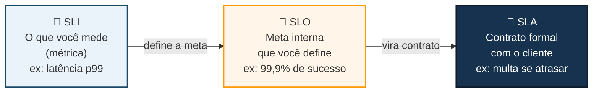
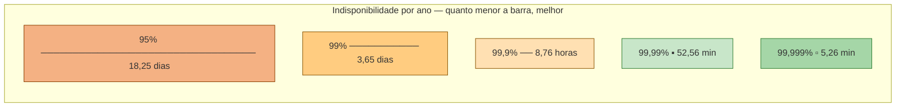
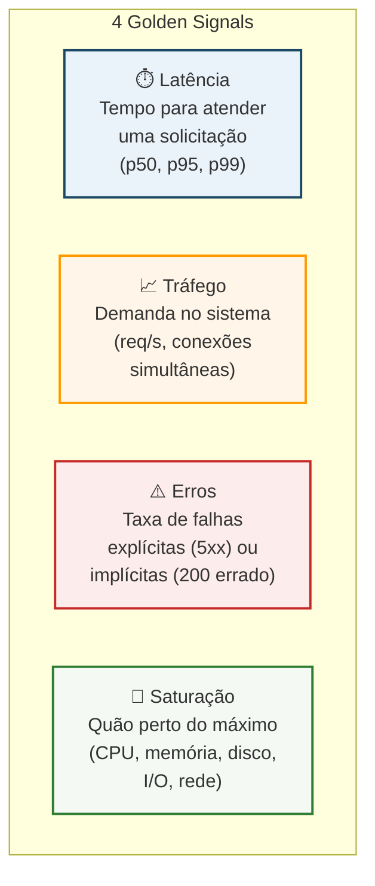
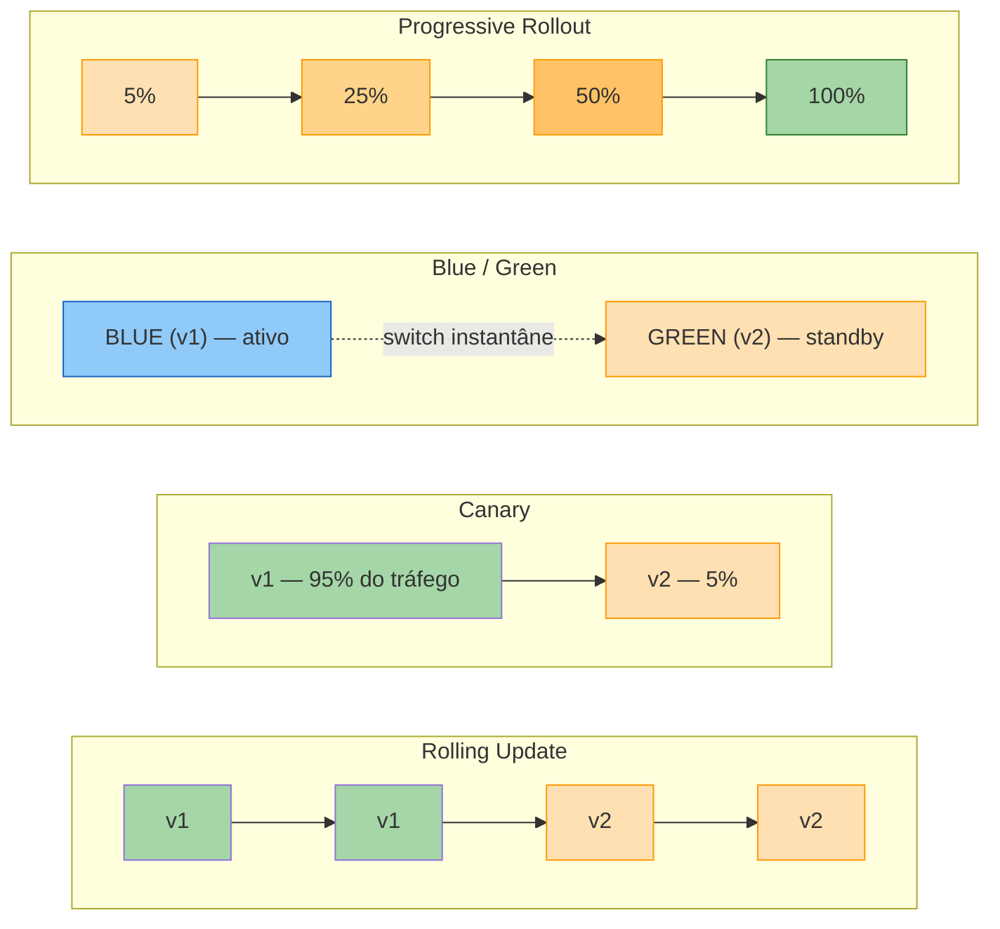
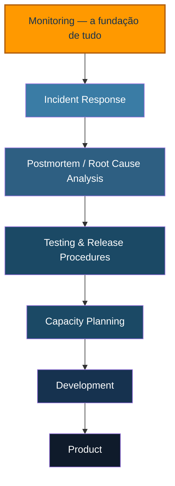
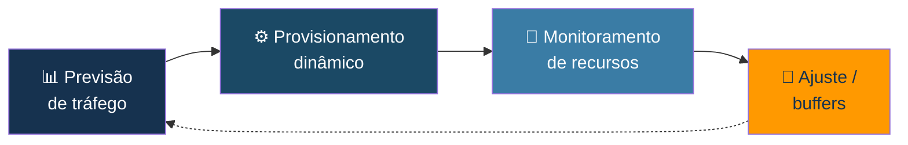

# SRE & DevOps — Guia de Estudos

> Princípios, Práticas e Ferramentas de Site Reliability Engineering, com foco em Multi-Cloud e Observabilidade.

`SLI · SLO · SLA` `Golden Signals` `Error Budget` `Deploy Strategies` `Postmortem`

---

## Sumário

1. [SLI, SLO, SLA e MTTR](#1--sli-slo-sla-e-mttr)
2. [Disponibilidade em números](#2--disponibilidade-em-números)
3. [Responsabilidades do SRE no dia a dia](#3--responsabilidades-do-sre-no-dia-a-dia)
4. [Princípios do SRE](#4--princípios-do-sre)
5. [Monitoramento e os Four Golden Signals](#5--monitoramento-e-os-four-golden-signals)
6. [Automação e Release Engineering](#6--automação-e-release-engineering)
7. [Estratégias de Implantação Gradual](#7--estratégias-de-implantação-gradual)
8. [Simplicidade](#8--simplicidade)
9. [Pirâmide do SRE (Práticas)](#9--pirâmide-do-sre-práticas)
10. [Incident Response & On-call](#10--incident-response--on-call)
11. [Postmortem e Root Cause Analysis (RCA)](#11--postmortem-e-root-cause-analysis-rca)
12. [Testing](#12--testing)
13. [Capacity Planning](#13--capacity-planning)
14. [Development & Product](#14--development--product)
15. [Ferramentas de SRE](#15--ferramentas-de-sre)
16. [DevOps vs SRE](#16--devops-vs-sre)

---

## 1 · SLI, SLO, SLA e MTTR

> **Explicando fácil:** pensa numa pizzaria. O **SLI** é o termômetro: "quantas pizzas chegaram no prazo hoje?".
> O **SLO** é a meta que a pizzaria define pra si mesma: "queremos 99% das pizzas entregues em até 30 min".
> O **SLA** é o contrato com o cliente, com multa se não cumprir: "se atrasar, a pizza é grátis".
> E o **Error Budget** é quanto a pizzaria "pode falhar" sem quebrar a promessa — se a meta é 99%, sobra 1%
> de folga pra testar entregador novo, rota nova, forno novo etc.

**Definições técnicas**

| Sigla | Significado | O que representa |
|---|---|---|
| **SLI** | Service Level Indicator | O que você mede (ex: latência, taxa de erro) |
| **SLO** | Service Level Objective | A meta interna que você quer atingir |
| **SLA** | Service Level Agreement | O acordo formal com o cliente (geralmente com penalidade) |
| **MTTR** | Mean Time To Repair | Tempo médio de reparo de um incidente |

> **📘 Nível avançado**
> `Error Budget = 100% − SLO`. Exemplo: se o SLO de disponibilidade é 99,9%, o error budget é 0,1% do tempo.
> Esse orçamento é consumido a cada minuto de indisponibilidade e serve como **gate de decisão**: budget
> estourado normalmente significa congelar releases não críticos e priorizar confiabilidade até o orçamento
> se recompor (prática descrita no *SRE Workbook* do Google, capítulo de Error Budget Policy).

---

## 2 · Disponibilidade em números

> **Explicando fácil:** quanto mais "noves" na porcentagem, menos tempo o sistema pode ficar fora do ar.
> Passar de 99% para 99,9% parece pouco no papel, mas na prática é a diferença entre **3,65 dias de sistema
> fora do ar por ano** e apenas **8,76 horas**. Cada "nove" a mais custa exponencialmente mais engenharia.

| Disponibilidade | Indisponibilidade / ano | Indisponibilidade / mês | Indisponibilidade / semana |
|---|---|---|---|
| 95% | 18,25 dias | 36 horas | 8,40 horas |
| 99% | 3,65 dias | 7,20 horas | 1,68 horas |
| 99,5% | 1,83 dias | 3,60 horas | 50,40 minutos |
| 99,9% | 8,76 horas | 43,20 minutos | 10,08 minutos |
| 99,95% | 4,38 horas | 21,60 minutos | 5,04 minutos |
| 99,99% | 52,56 minutos | 4,32 minutos | 1,01 minutos |
| 99,999% | 5,26 minutos | 25,92 segundos | 6,05 segundos |

---

## 3 · Responsabilidades do SRE no dia a dia

- **Design e Arquitetura** — colaborar com o time de dev para projetar arquiteturas resilientes.
- **Monitoração e Alerta** — configurar sistemas sofisticados para acompanhar a saúde dos serviços e responder a incidentes.
- **Automação** — usar código para reduzir esforço manual e permitir implantações rápidas e confiáveis.
- **Gestão de Lançamento** — garantir que mudanças sejam implantadas com segurança e impacto mínimo.
- **Planejamento de Capacidade** — garantir que os sistemas suportem cargas atuais e futuras.
- **Otimização de Performance** — reduzir latência e melhorar eficiência geral.
- **Backup e Disaster Recovery** — preparar planos para eventos catastróficos (RPO e RTO).
- **Segurança e Conformidade** — garantir que os sistemas atendam a padrões de segurança.

> **📘 Nível avançado**
> Na AWS, essas responsabilidades se traduzem em práticas concretas: Well-Architected Framework (pilar de
> Confiabilidade e Excelência Operacional), Auto Scaling + Multi-AZ para capacidade e resiliência, AWS Backup
> + estratégias de DR (Backup & Restore, Pilot Light, Warm Standby, Multi-Site Active/Active) para RPO/RTO,
> e AWS Config + Security Hub para conformidade contínua.

---

## 4 · Princípios do SRE

> **Explicando fácil:** imagina que sua pizzaria está sempre pegando fogo um pouquinho (isso é normal, todo
> sistema tem risco). O SRE não tenta apagar 100% dos focos de incêndio — isso custaria caro demais e deixaria
> tudo lento. Ele aceita um "tanto de fogo" controlado (Error Budget), automatiza o que for repetitivo (chega
> de catar pizza queimada com a mão), mede tudo com termômetros (monitoramento) e, quando pega fogo de verdade,
> investiga **por que pegou fogo** — não quem acendeu o fósforo.

### 4.1 Embracing Risk (Aceitação de Risco)
Nenhum sistema é 100% confiável. Buscar 100% de disponibilidade é inviável e trava inovação. O **Error Budget**
define o limite aceitável de falhas, equilibrando confiabilidade, inovação e alocação de recursos.

### 4.2 Definição de Níveis de Serviço (SLI / SLO / SLA)
Todo serviço deve ter métricas definidas (SLI), metas internas (SLO) e, quando aplicável, acordos formais com
o cliente (SLA) — veja a Seção 1.

### 4.3 Eliminating Toil (Eliminação de Trabalho Repetitivo)
SREs devem focar em engenharia, reduzindo tarefas manuais e repetitivas. O Toil não eliminado gera:

| Consequência | Consequência |
|---|---|
| Estagnação na carreira | Reversão (rollback) lenta |
| Falta de padronização | Aumento de atrito e turnover (attrition) |
| Progresso e inovação lentos | Esgotamento (burnout) |
| Experimentação lenta | Efeito "bola de neve" — cresce junto com o serviço |

### 4.4 Monitoring (Monitoramento)
Monitoramento contínuo é essencial para insights em tempo real sobre saúde, desempenho e confiabilidade.
Por padrão é **reativo**; o objetivo do SRE é torná-lo **proativo**, com alarmes bem calibrados.

| Termo | Definição |
|---|---|
| Monitoring | Coleta, processamento, agregação e exibição de dados quantitativos |
| White-box monitoring | Baseado em métricas internas do sistema, incluindo logs |
| Black-box monitoring | Testes externos que observam o comportamento como um usuário veria |
| Dashboard | Resumo visual das métricas principais de um serviço |
| Alert | Notificação destinada a um humano ou automação |
| Node / Target / Instance | Recurso a ser monitorado |

### 4.5 Automation (Automação)
Força transformadora que eleva eficiência, aumenta confiabilidade e reduz erros humanos — prática fundamental
para escalabilidade.

### 4.6 Release Engineering (Engenharia de Lançamento)
Gestão e otimização de todo o processo de lançamento: do código-fonte à implantação em produção.

- **Build e deployment contínuo** — pipeline de entrega robusto e automatizado.
- **Controle de versão** — rastreamento de mudanças, releases reprodutíveis, versionamento e tags.
- **Testes e validações** — testes unitários, de integração e ponta a ponta antes da implantação completa.
- **Implementação gradual** — ver Seção 7.

### 4.7 Simplicity (Simplicidade) e Cultura Sem Culpa
Soluções diretas e minimalistas, evitando overengineering. Postmortems analisam falhas buscando a causa raiz
no **processo**, nunca culpando pessoas.

---

## 5 · Monitoramento e os Four Golden Signals

> **Explicando fácil:** pensa num médico examinando um paciente: ele checa **temperatura**, **pressão**,
> **batimentos** e **respiração**. Os Golden Signals são o "check-up básico" de qualquer sistema — se você
> só puder olhar 4 métricas antes de sair correndo, olhe estas.

**Boas práticas de alerta**

- **Definir métricas relevantes** — KPIs e SLIs críticos, evitando ruído.
- **Estabelecer limites adequados** — estáticos ou dinâmicos, com base em dados históricos/sazonalidade.
- **Evitar fadiga de alerta** — alertar apenas quando realmente necessário; limites conservadores.
- **Combinar métricas** — alertas compostos reduzem falsos positivos.

> **Exemplo prático de alerta composto**
> Métrica 1: taxa de abandono de carrinho > 50% **E** Métrica 2: tempo de resposta no checkout > 3s →
> alerta disparado apenas se **ambas** as condições ocorrerem simultaneamente. Isso reduz falso positivo e
> aponta melhor para a causa raiz (ex: checkout lento derrubando conversão).

> **📘 Nível avançado**
> Na AWS, os Golden Signals mapeiam diretamente para CloudWatch Metrics + Alarms: Latência
> (`TargetResponseTime` do ALB), Tráfego (`RequestCount`), Erros (`HTTPCode_Target_5XX_Count`) e Saturação
> (`CPUUtilization`, `MemoryUtilization` via CloudWatch Agent). Para alertas compostos, use **Composite
> Alarms** do CloudWatch combinando múltiplos alarmes com AND/OR.

---

## 6 · Automação e Release Engineering

A engenharia de liberação abrange todas as atividades de preparação, teste e implantação de novas versões em
produção — do código-fonte até o deploy. Envolve:

- **Build e deployment contínuo** — pipeline automatizado da integração do código até a implantação.
- **Controle de versão** — visibilidade clara via Git, rastreamento de mudanças, releases reprodutíveis, bem
  documentados, com estratégia de tags/versionamento.
- **Testes e validações** — testes unitários, integração e ponta a ponta antes da implantação completa.

> **Explicando fácil:** comece a pensar em "como vou lançar isso com segurança" desde o primeiro dia do
> projeto — é bem mais barato fazer certo desde o MVP do que remendar depois. É como construir uma casa já
> pensando na porta de saída de emergência, não depois que ela pegou fogo.

---

## 7 · Estratégias de Implantação Gradual

| Estratégia | Downtime | Rollback | Custo infra | Uso típico |
|---|---|---|---|---|
| **Rolling Update** | Zero (se bem configurado) | Lento (reverte pod a pod) | Baixo | Padrão do Kubernetes (Deployment) |
| **Canary** | Zero | Rápido (poucos afetados) | Médio | Mudanças de risco médio/alto |
| **Blue/Green** | Zero | Instantâneo | Alto (2x recursos) | Mudanças críticas, compliance |
| **Progressive Rollout** | Zero | Rápido, gradual | Médio | Feature flags + observabilidade |

> **📘 Nível avançado**
> Na AWS: Rolling Update é nativo do ECS/EKS (`maxSurge`/`maxUnavailable`); Canary e Blue/Green são
> suportados nativamente pelo **AWS CodeDeploy** (para Lambda e ECS) e pelo **Route 53 weighted routing** ou
> **ALB weighted target groups**; Progressive Rollout costuma ser implementado com **AWS AppConfig**
> (feature flags) combinado a CloudWatch Alarms como gatilho automático de rollback.

---

## 8 · Simplicidade

Princípio que enfatiza soluções diretas e minimalistas, evitando complexidade desnecessária e overengineering.

**Cuidados com o desenvolvedor**
- Entusiasmo técnico em excesso
- Falta de clareza nos requisitos
- Comunicação inadequada
- Medo de "perder algo" no futuro

**Não se apegue ao código**
- Apego emocional ao código
- "E se precisarmos desse código depois?"
- O controle de versão já guarda o histórico

**Outros pilares da simplicidade**
- **Modularidade** — habilite só o que precisa (monitoramento, load balancing, auto scaling...).
- **Retrocompatibilidade** — versões novas continuam funcionando com as antigas.
- **Documentação** — reduz curva de aprendizado e solicitações de suporte.
- **Simplicidade na liberação** — releases fáceis de entender, usar e manter.

---

## 9 · Pirâmide do SRE (Práticas)

> **Explicando fácil:** as práticas são a "mão na massa" dos princípios. E elas têm uma ordem de prioridade:
> não adianta pensar em planejamento de capacidade (topo da pirâmide) se você nem tem monitoramento básico
> (base da pirâmide) funcionando. É como construir o telhado antes da fundação.

*(a seta indica a ordem de maturidade — cada camada assume que a de baixo já está consolidada)*

As práticas são a implementação prática dos princípios de SRE.

---

## 10 · Incident Response & On-call

A maturidade na resposta a incidentes é a espinha dorsal de sistemas resilientes — minimiza tempo de
inatividade e protege a confiança dos usuários em momentos críticos.

- **On-call** — SREs devem ficar no máximo 50% do tempo em atividades operacionais; a rotação de plantão
  deve ser bem estruturada para resposta rápida fora do horário comercial.
- **Resolução de problemas eficaz** — sistemas de monitoramento devem fornecer contexto para os alertas; SRE
  deve dominar as ferramentas de depuração disponíveis.
- **Gerenciamento de incidentes** — processo claro de papéis e responsabilidades (R&R) para incidentes críticos.

---

## 11 · Postmortem e Root Cause Analysis (RCA)

> **Explicando fácil:** postmortem e RCA são como detetives investigando um crime: eles não param no "quem
> estava no local" — eles perguntam "por que isso foi possível?" até chegar na causa raiz. E a regra de ouro
> é: **cultura sem culpados** — o objetivo é aprender e consertar o processo, não demitir alguém.

**O que um postmortem deve conter**
- Tempo de inatividade ou degradação visível ao usuário
- Perda de dados de qualquer tipo
- Intervenção de engenheiros de plantão (ações técnicas tomadas)
- Hora de início e término (tempo de resolução)
- Plano de ação para minimizar/evitar recorrência

> **RCA na prática**
> Abordagem sistemática para ir além dos sintomas e achar a causa raiz. Rastreie interrupções, crie
> recomendações **acionáveis**, atribua a times/pessoas específicas e priorize por avaliação de risco.

---

## 12 · Testing

Testes protegem a confiabilidade e a satisfação do usuário, detectando problemas antes que cheguem à
produção. Devem abranger todo o pipeline: programação, segurança, bugs, implantação, capacidade.

| Tipo de teste | O que valida |
|---|---|
| Teste unitário | Uma unidade isolada de software (classe ou função) |
| Teste de integração | Componentes que já passaram em testes unitários, montados juntos |
| Teste de sistema | Sistema completo integrado — smoke tests, performance, regressão ponta a ponta |
| Teste de deployment | Estratégia de implantação (ex: blue/green, canary) valida confiabilidade antes do rollout completo |

> **Backup, Recovery e Disaster Recovery**
> Impactam diretamente o **RPO** (Recovery Point Objective — quanto dado você pode perder) e o **RTO**
> (Recovery Time Objective — quanto tempo até restaurar). Execute testes regulares de restauração e crie
> (ou automatize) runbooks de recuperação.

---

## 13 · Capacity Planning

> **Explicando fácil:** é tipo planejar quantas pizzas fazer no sábado à noite: você olha o histórico
> (quantas vendeu nos últimos sábados), soma uma folga de segurança (buffer) pra imprevistos, e ajusta o
> forno (auto scaling) conforme o movimento real da noite.

**Tratamento de sobrecarga**
- Gerenciamento de filas
- Circuit breakers
- Escala automática
- Load shedding (descartar excessos)
- CDNs

> **Falhas em cascata**
> Uma falha em um componente desencadeia falhas em outros interconectados — comum em microsserviços/
> serverless. Mitigue com circuit breakers, retentativas com backoff crescente, load shedding e isolamento
> de componentes.

---

## 14 · Development & Product

Em SRE, desenvolvimento não é só escrever código — é engenharia de confiabilidade: automação, testes e
observabilidade formam a base para sistemas que lidam bem com qualquer desafio.

- Automatizar processos repetitivos, implantações, monitoramento e resposta a incidentes.
- Construir e integrar ferramentas (monitoramento, segurança, IaC com Chef/Puppet/Ansible).
- Infraestrutura como Código (IaC) — controle de mudanças, consistência, provisionamento eficiente.
- Controle de versão e revisão de código — Git + code review para qualidade e compartilhamento de conhecimento.
- Segurança integrada ao ciclo de desenvolvimento — codificação segura, varredura de vulnerabilidades.

O produto final deve ser **leve, robusto, escalável e adaptável** a novos recursos — retrocompatível, bem
documentado e fácil de usar.

---

## 15 · Ferramentas de SRE

| Categoria | Ferramentas |
|---|---|
| Infraestrutura como Código | Terraform, Terragrunt, AWS CDK, CloudFormation |
| Gerenciamento de configuração | Chef, Puppet, Ansible, PowerShell, Bash |
| Monitoramento e alerta | Prometheus, Grafana, CloudWatch, AppDynamics, Datadog |
| Gestão de TI e documentação | ServiceNow, Jira, Confluence |
| Provedores de nuvem | AWS, GCP, Azure |
| CI/CD | GitHub Actions, GitLab CI, CodeBuild/CodePipeline, Jenkins |

---

## 16 · DevOps vs SRE

| | **DevOps** | **SRE** |
|---|---|---|
| Definição | Cultura e prática que remove barreiras entre quem cria o código (dev) e quem cuida do sistema (ops) | Engenharia de confiabilidade criada pelo Google |
| Foco | Acelerar a entrega contínua de software com segurança, via automação de testes e lançamento | Garantir que o serviço fique sempre no ar e funcione bem |

| Aspecto | DevOps | SRE |
|---|---|---|
| Objetivo principal | Velocidade de lançamento | Estabilidade do ambiente |
| Natureza | Filosofia geral de trabalho | Implementação prática e mensurável da confiabilidade |
| Métricas centrais | Frequência de deploy, lead time | SLI / SLO / SLA / Error Budget |

> **Resumindo**
> DevOps é a cultura de colaboração e automação de entregas. SRE aplica engenharia de software para garantir
> a alta disponibilidade dos sistemas — na prática, SRE pode ser visto como "uma forma específica e
> mensurável de implementar DevOps".

---

Guia de estudos baseado no *Google SRE Book* e *SRE Workbook*, com anotações e incrementos próprios.
